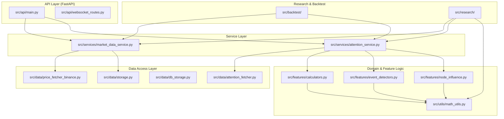

# Crypto Attention Lab - Architecture Diagram

This diagram represents the current architecture of the backend system after the recent refactoring.

## Key Components

### 1. API Layer
- **Entry Point**: `src/api/main.py`
- **Responsibilities**: Routing, Request Validation, Response Formatting.
- **Dependencies**: Calls into Service Layer.

### 2. Service Layer
- **MarketDataService**: Central hub for price data (OHLCV). Handles alignment and caching.
- **AttentionService**: Central hub for attention metrics and events. Orchestrates fetching, feature calculation, and event detection.

### 3. Domain & Feature Logic
- **Calculators (`src/features/calculators.py`)**: Pure functions for calculating attention metrics (z-scores, moving averages).
- **Event Detectors (`src/features/event_detectors.py`)**: Pure logic for detecting attention spikes and other events.
- **Math Utils (`src/utils/math_utils.py`)**: Shared mathematical primitives (rolling z-score, rolling quantile, safe percentage change) used across Features and Research.

### 4. Data Access Layer
- **Fetchers**: Interact with external APIs (Binance, Twitter, Google Trends).
- **Storage**: Manages local CSV/Parquet files and SQLite database.

### 5. Research & Backtest
- Consumers of the Service and Feature layers for analysis and strategy simulation.
